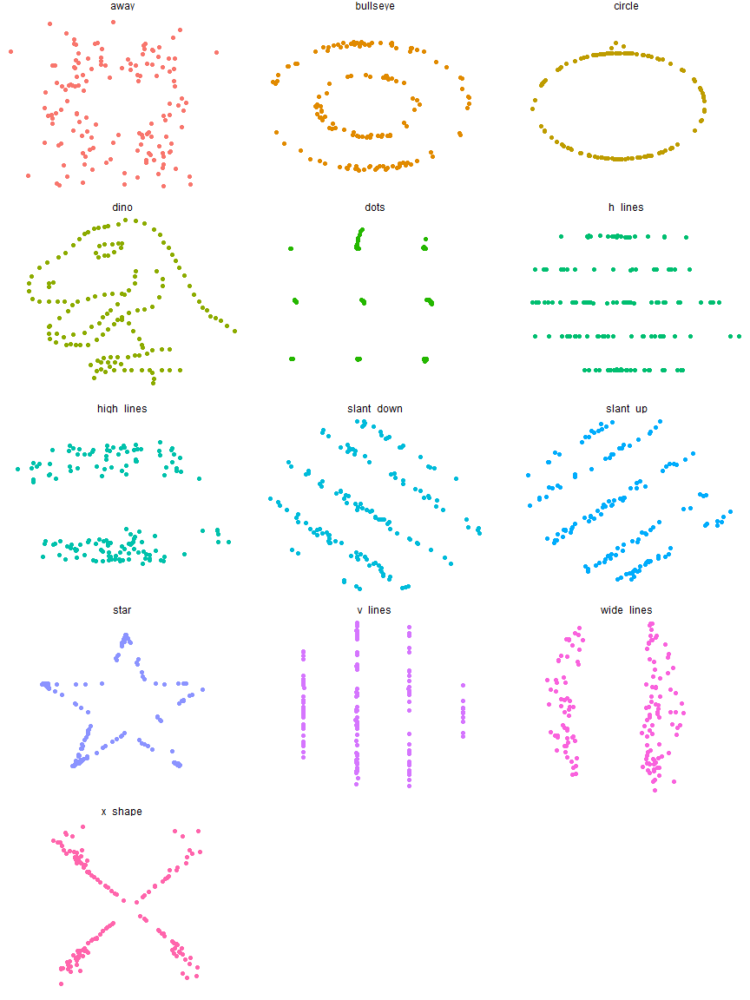

<!-- README.md is generated from README.Rmd. Please edit that file -->
datasauRus
==========

[](https://travis-ci.org/stephlocke/datasauRus)

This package wraps the awesome Datasaurus Dozen dataset.

The Datasaurus was created by Alberto Cairo in this great [blog post](http://www.thefunctionalart.com/2016/08/download-datasaurus-never-trust-summary.html).

Datasaurus shows us why visualisation is important, not just summary statistics.

He's been subsequently made even more famous in the paper [Same Stats, Different Graphs: Generating Datasets with Varied Appearance and Identical Statistics through Simulated Annealing](https://www.autodeskresearch.com/publications/samestats) by Justin Matejka and George Fitzmaurice.

In the paper, Justin and George simulate a variety of datasets that the same summary statistics to the Datasaurus but have very different distributions.


This package looks to make these datasets available for use as an advanced [Anscombe's Quartet](https://en.wikipedia.org/wiki/Anscombe%27s_quartet), available in R as `anscombe`.

Install
-------

Currently, only available on GitHub, so use `devtools` to install the package

``` r
devtools::install_github("stephlocke/datasauRus")
```

Usage
-----

You can use the package to produce Anscombe plots and more.

``` r
library(ggplot2)
library(datasauRus)
ggplot(datasaurus_dozen, aes(x=x, y=y, colour=dataset))+
  geom_point()+
  theme_void()+
  theme(legend.position = "none")+
  facet_wrap(~dataset, ncol=3)
```



Tests
-----

``` r
library(devtools)
test()
#> Loading datasauRus
#> Loading required package: testthat
#> Testing datasauRus
#> datasets: ......................
#> Raw files: .
#> 
#> DONE ======================================================================
```

Contributing to the package
---------------------------

### Code of Conduct

Anyone getting involved in this package agrees to our [Code of Conduct](CONDUCT.md). If someone is breaking the Will Wheaton rule aka *Don't be a dick*, or breaking the Code of Conduct, please let me know at <steph@itsalocke.com>

### Bug reports

When you file a [bug report](https://github.com/stephlocke/datasauRus/issues), please spend some time making it easy for us to follow and reproduce. The more time you spend on making the bug report coherent, the more time we can dedicate to investigate the bug as opposed to the bug report.

### Ideas

Got an idea for how we can improve the package? Awesome stuff!

Please [raise it](https://github.com/stephlocke/datasauRus/issues) with some succinct information on expected behaviour of the enhancement and why you think it'll improve the package.

### Package development

We really want people to contribute to the package. A great way to start doing this is to look at the [help wanted](https://github.com/stephlocke/datasauRus/issues?q=is%3Aissue+is%3Aopen+label%3A%22help+wanted%22) issues and/or contribute an example.

Examples for this package are done in base R or with ggplot2 as an optional example, using the structure:

``` r
if(require(ggplot2)){
#ggplot2 code here
}
```

As this is a data package, most of the documentation is sitting in one file (`R/Datasaurus-package.R`) so we keep the examples in a separate directory (`inst/examples`).

-   If there isn't a file for the dataset you want to write an example for, you can make one by just calling it `datasetname.R`. To reference an example file, add the line `@example inst/datasetname.R` in the relevant documentation section of `R/Datasaurus-package.R`.

### Conventions

We're relatively loose on coding conventions.

-   Datasets are lower-case with underscores between words
-   R code should be formatted with the "Reformat code" option in RStudio
-   There are no standards for base R plots
-   My preferred ggplot2 themes are `theme_minimal` where axes labels matter and `theme_void` when they do not but I'm OK with the default ggplot2 theming if you want to avoid writing longer ggplot2 code
